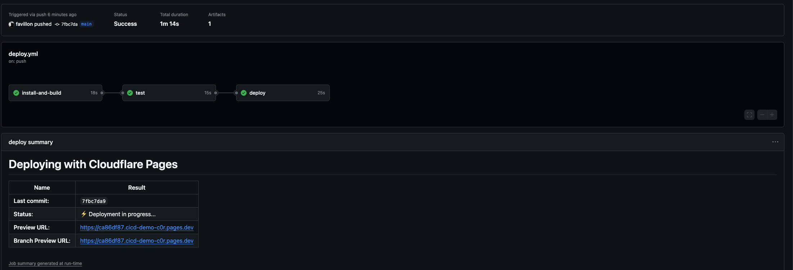
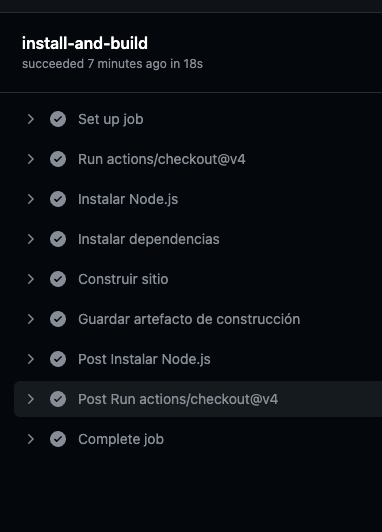
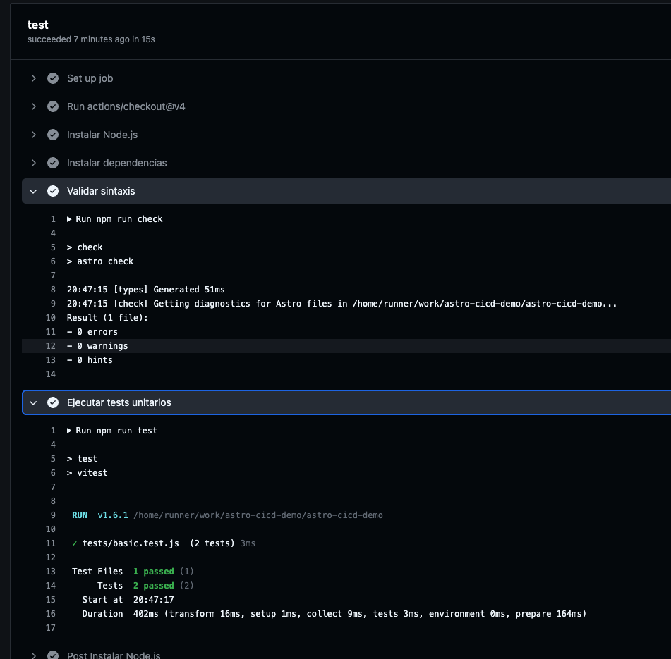
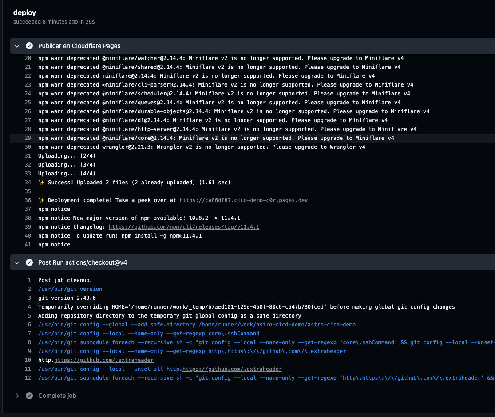

# astro-cicd-demo

 Ejemplo de como hacer un despliegue de una aplicación con Astro y GitHub Actions.

 Simulando la ejecicion de un ciclo de  CI/CD

# Deploy de la aplicación
------------------------------

------------------------------

------------------------------

------------------------------
